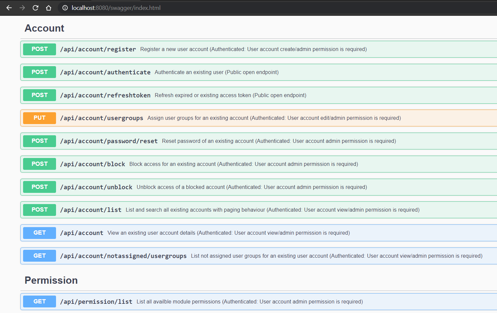

# IdentityServer
An [OAuth 2.0](https://tools.ietf.org/html/rfc6749 "OAuth 2.0") standard Identity Access Management (IAM) API for ASP.NET Core with JWT Bearer Token authentication.

### Features
1. User account registration (for admins)
2. Authentication & Token refresh
3. Password reset
4. Account lockout for failure attempts
5. Block/unblock user accounts
6. Permissions & User groups
7. View accounts, permissions and groups
8. Manage user permissions and groups

## Method1 - How to build (Boring)
* Install the latest [.NET Core 3.1](https://dotnet.microsoft.com/download#/current ".NET Core 3.1") SDK
* Install the [MS SQL server](https://www.microsoft.com/en-us/sql-server/sql-server-downloads?rtc=1 "MS SQL server") Database
* Install Git
* Clone this repo
* Go to Identity.API folder on cloned repo, and Run the project using `dotnet run` command
* Project will be accessible under `http://localhost:8080`

## Method2 - How to build (Easy)
* Prerequisite - Docker + Docker compose on your Developer machine
* Go to cloned repo root folder, and Run the project using `docker-compose up -d --buid`
* This will spin-up MSSQL DB (on port `1433`) + IdentityServer API (on port `8080`) containers on your machine
* Project will be accessible under `http://localhost:8080`

## How to use
An API documentation can be found under `http://localhost:8080/swagger` url after the application is successfully run.

### Sample user account
* Admin account - username: `identity.admin@gmail.com`, password: `Admin@#456`

### How to change DB password & API ruuning Ports -
* Docker runnig - DB passowrd can be changed using `.env` file and default port mapping can be changed on `docker-compose.yml` file.
* Non-docker - DB configurations & kestrel port mapping can be changed using `appsettings.json` or `appsettings.Development.json` file on the project based on the environment `Development` or `Production`.
